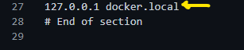

# Dockerize Development Environment

- [Dockerize Development Environment](#dockerize-development-environment)
  - [Docker Compose](#docker-compose)
    - [Create Docker Compose file](#create-docker-compose-file)
    - [Run Docker Compose](#run-docker-compose)
    - [Make a Change and Re-run the Docker Compose file](#make-a-change-and-re-run-the-docker-compose-file)
    - [Adding Your Own Content](#adding-your-own-content)
    - [Adding a virtual host](#adding-a-virtual-host)
      - [Modify your `hosts` file](#modify-your-hosts-file)
    - [Adding a virtual host](#adding-a-virtual-host-1)

## Docker Compose

### Create Docker Compose file

At the root folder of your project, add a `docker-compose.yml` file.  Add the following:

```YAML
version: '3.5'

services:
 nginx:
  image: nginx:alpine
  container_name: docker-nginx
  ports:
    - '80:80'                   ## host_port:docker_port
```

<small>[DockerHub:Nginx](https://hub.docker.com/_/nginx)</small>

### Run Docker Compose

From the command line of the root folder (where your `docker-compose.yml` file is located), run the following:

```console
docker-compose up -d 

## -d : run in detached mode
```

If this is the first run, docker will pull the image from the registry.

To check your nginx server is running, run the following command

```console
docker ps

## ps: list docker processes (containers)
```

To run your nginx website, open your browser to <http://localhost>

### Make a Change and Re-run the Docker Compose file

Let's change the host port to 8080:

```YAML
version: '3.5'

services:
 nginx:
  image: nginx:alpine
  container_name: docker-nginx
  ports:
    - '8080:80'                   ## host_port:docker_port
```

Now re-run docker-compose

```console
docker-compose up -d 
```

Look at the docker processes. Not the nginx web server is now running on port 8080

```console
docker ps
```

The previous link (<http://localhost>) no longer works . The site can be found at <http://localhost:8080>

### Adding Your Own Content

In the root directory, add a new directory named `code`. This is where your html for your site will live.

Add a file called index.html and add some content:

```html
<h1>Hello there! updated</h1>
```

Then mount the `code` directory as a volume. We'll also reset the host port to 80

```yaml
version: '3.5'

services:
 nginx:
  image: nginx:alpine
  container_name: docker-nginx
  ports:
    - '80:80'
  volumes:
    - ./code:/code
    
```

Let's add a place for the configuration for our containers. In the root directory, add a new directory named `docker`.

Now add a sub-directory called `nginx`. In this folder add a file (no extension) called `vhost`

```json
server {
    index index.php index.html;
    error_log /var/log/nginx/error.log;
    access_log /var/log/nginx/access.log;
    root /code;               // instruct nginx to use our content
}
```

Add this to your docker-compose.yml file under volumes

```YAML
version: '3.5'

services:
 nginx:
  image: nginx:alpine
  container_name: docker-nginx
  ports:
    - '80:80'
  volumes:
    - ./code:/code
    - ./docker/nginx/vhost:/etc/nginx/conf.d/default.conf

```

Run docker-compose

```console
docker-compose up -d 
```

To run your nginx website, open your browser to <http://localhost>. **Note:** Now that the `code` folder is mounted as a volume to your container, you can edit the files there and reload.

### Adding a virtual host

Now we add a custom server name `docker.local` to `vhost`

```json
server {
    index index.php index.html;
    server_name docker.local;               // custom "domain" name - http://docker.local
    error_log /var/log/nginx/error.log;
    access_log /var/log/nginx/access.log;
    root /code;               // our content
}
```

#### Modify your `hosts` file

In windows 10, this will be in the path:

```console
C:\Windows\System32\drivers\etc
```

Add your custom server name (
### Adding a virtual host

Now we add a custom server name `docker.local`:



Run docker-compose

```console
docker-compose up -d 
```

To run your nginx website, open your browser to <http://localhost>.
